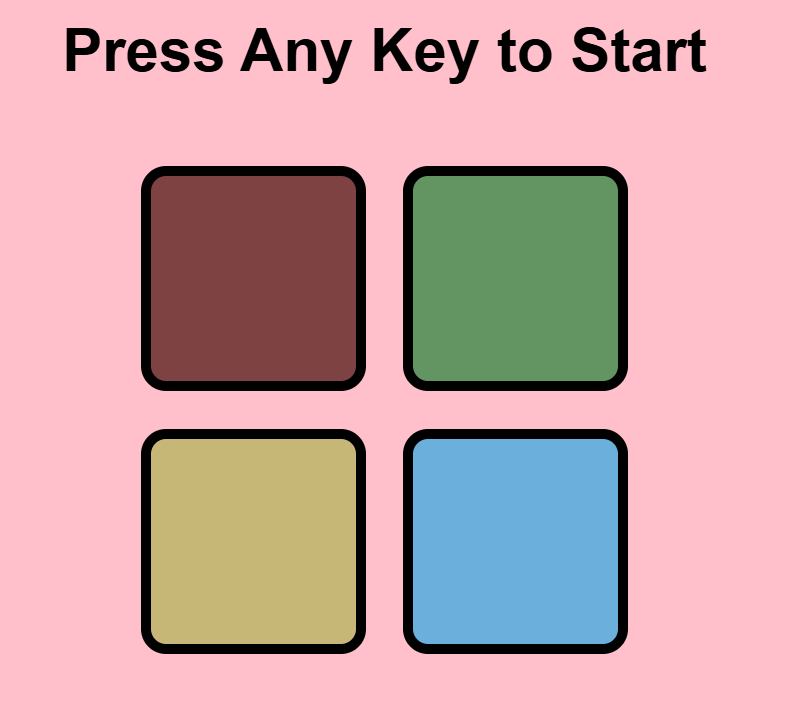

# 🎮 Simon Plays Game

A classic **Simon Memory Game** built using **HTML, CSS, and JavaScript**.

The game challenges players to remember and repeat an increasingly long sequence of colors. Each successful level adds a new color to the pattern, testing your memory and concentration.

---

## 🚀 Features

* 🎨 Interactive 4-color game board
* 📈 Dynamic level progression
* ✨ Button flash animations
* 🧠 Memory-based gameplay
* ❌ Game Over detection
* 🔄 Restart functionality
* 📱 Responsive and clean user interface

---

## 🛠️ Technologies Used

* HTML5
* CSS3
* JavaScript (Vanilla JS)

---

## 🎯 How to Play

1. Press any key to start the game.
2. Watch the color sequence displayed by the game.
3. Repeat the sequence by clicking the colored buttons in the correct order.
4. Each new level adds one more color to the sequence.
5. If you click the wrong button, the game ends.
6. Press any key to restart and try to beat your previous level.

---

## 📂 Project Structure

```
Simon-Plays-Game/
│── index.html
│── style.css
│── app.js
│── README.md
```

---


## 📸 Preview



---

## 🌟 Future Improvements

* 🔊 Sound effects for each button
* 🏆 High score tracking
* 🎵 Background music
* 📱 Improved mobile responsiveness
* ⚡ Enhanced animations and visual effects

---

## 👩‍💻 Author

**Priti Bhardwaj**

If you enjoyed this project, feel free to ⭐ this repository!

